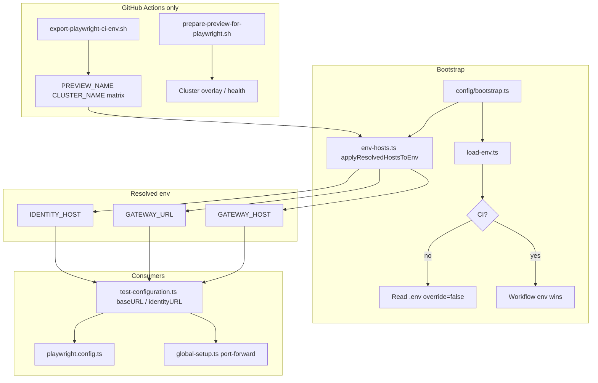

# CI vs local environment flow

Playwright tests resolve cluster URLs from the same env vars in CI and locally; only transport differs (HTTPS vs port-forward).



## Key variables

| Variable                          | CI                                   | Local                  |
| --------------------------------- | ------------------------------------ | ---------------------- |
| `PREVIEW_NAME`                    | Matrix cell (`pr-123-rabbit-n-d`, …) | From `.env`            |
| `CLUSTER_NAME` / `CLUSTER_DOMAIN` | Workflow                             | `.env`                 |
| `GATEWAY_HOST`                    | Derived or explicit                  | Derived + `LOCAL_PORT` |
| `GATEWAY_URL`                     | `https://…`                          | `http://…:8080`        |
| Test users                        | GitHub vars/secrets `ACCEPTANCE_*`   | `.env`                 |

## Override polling in slow clusters

```bash
PLAYWRIGHT_POLL_QUERY_SYNC_MS=90000 npm test
```

Auth for tests uses worker-scoped `AuthCache`; setup/preflight uses `withAuthenticatedContext()` from `fixtures/auth-context.ts` (same `ContextFactory` path).
