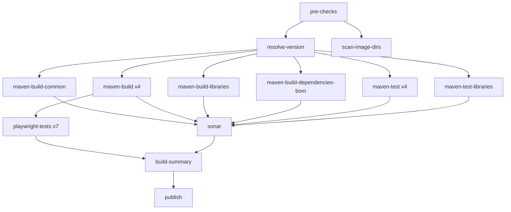

# Parallel CI Pipeline (atomic layout)

This document describes the job layout in [`.github/workflows/main.yml`](../../.github/workflows/main.yml) on branch `ci/parallel-pipeline-poc`.

## Goals

| Goal                | How                                                               |
| ------------------- | ----------------------------------------------------------------- |
| Short feedback loop | Validation, builds, unit tests, and Playwright overlap where safe |
| Rerun-friendly      | One failed image cell → rerun one matrix job                      |
| Full coverage       | Per-image unit tests + Playwright on 7 broker profiles            |
| Maintainability     | `maven-build` from alfresco-build-tools + docker-scan matrix      |

## Architecture



Parallel graph (Elias review): **build-common**, per-image **build** / **test**, library **build** / **test**, and **BOM** all start after `resolve-version` without waiting on each other. Playwright starts when per-image **build** (with Docker) completes.

`main.yml` uses [`maven-build`](https://github.com/Alfresco/alfresco-build-tools/blob/master/.github/actions/maven-build/action.yml) and [`sonar-scan-on-built-project`](https://github.com/Alfresco/alfresco-build-tools/blob/master/.github/actions/sonar-scan-on-built-project/action.yml) from alfresco-build-tools. Docker/test matrices come from `scan-image-dirs` + [`.github/ci/docker-image-services.json`](../../.github/ci/docker-image-services.json); libraries from [`.github/ci/library-modules.json`](../../.github/ci/library-modules.json). Playwright profiles: [`.github/ci/playwright-profiles.json`](../../.github/ci/playwright-profiles.json). See [process-services alignment](process-services-alignment.md).

## Job reference

| Job                            | Runs exactly once per workflow? | Purpose                                                                                                                              |
| ------------------------------ | ------------------------------- | ------------------------------------------------------------------------------------------------------------------------------------ |
| `pre-checks`                   | ✓                               | Lint/pre-commit, dependabot gate, SHA pins                                                                                           |
| `resolve-version`              | ✓                               | PR snapshot / release version                                                                                                        |
| `maven-build-common`           | ✓                               | Shared foundations + common tests (`api`, `service-common`)                                                                          |
| `scan-image-dirs`              | ✓                               | Discover Docker image dirs; build matrix JSON                                                                                        |
| `maven-build`                  | 4 matrix cells                  | Per docker image: `mvn install -pl … -am` + Docker push (no m2-common download)                                                      |
| `maven-build-libraries`        | 2 matrix cells                  | Library-only modules (messages-graphql, audit)                                                                                       |
| `maven-build-dependencies-bom` | ✓                               | Aggregated BOM (`-pl activiti-cloud-dependencies -am`), parallel with builds                                                         |
| `maven-test`                   | 4 matrix cells                  | `mvn verify` per docker image (parallel, root `-pl -am`)                                                                             |
| `maven-test-libraries`         | 2 matrix cells                  | `mvn verify` per library module                                                                                                      |
| `sonar`                        | ✓                               | Download `target*` + `m2*`, `compile`, then `sonar:sonar` (test cells upload `target-test-*` so build `target-*` is not overwritten) |
| `playwright-tests`             | 7 matrix cells                  | Helm + full Playwright suite per broker profile                                                                                      |
| `build-summary`                | ✓                               | Merge gate (build, tests, coverage, Playwright)                                                                                      |
| `delete-test-images`           | ✓                               | Delete stale PR Docker tags before fresh push (parallel with builds)                                                                 |
| `publish`                      | ✓ (push / preview PR)           | Maven deploy after `build-summary` green                                                                                             |

Legacy monolithic `acceptance-tests` job is **removed** — Playwright runs on the same broker profiles instead.

### Playwright matrix profiles

| Profile                            | Broker   | Partitioning    | Destinations          |
| ---------------------------------- | -------- | --------------- | --------------------- |
| `rabbitmq-partitioned-default`     | rabbitmq | partitioned     | default-destinations  |
| `rabbitmq-non-partitioned-default` | rabbitmq | non-partitioned | default-destinations  |
| `kafka-partitioned-default`        | kafka    | partitioned     | default-destinations  |
| `kafka-non-partitioned-default`    | kafka    | non-partitioned | default-destinations  |
| `kafka-partitioned-override`       | kafka    | partitioned     | override-destinations |
| `rabbitmq-non-partitioned-pdb`     | rabbitmq | non-partitioned | pdb                   |
| `rabbitmq-prefix-pdb`              | rabbitmq | prefix          | pdb                   |

Each cell: install Helm → health checks → `prepare-preview-for-playwright` → `npm run test:all` (full suite) → teardown. `max-parallel: 4` matches shared cluster capacity.

### Per-image Maven scope

Configured in [`.github/ci/docker-image-services.json`](../../.github/ci/docker-image-services.json) (`extraModules`, `testMavenFlags`). Library modules: [`.github/ci/library-modules.json`](../../.github/ci/library-modules.json).

`activiti-cloud-query` uses `-T 1 -DunitTests.parallel=false` via `testMavenFlags` to avoid flaky Testcontainers/Liquibase races.

## Playwright integration

| Job                | Purpose                                                                                                                        |
| ------------------ | ------------------------------------------------------------------------------------------------------------------------------ |
| `playwright-tests` | Matrix ×7. Per cell: Helm install, health checks, overlay, full Playwright suite (`npm run test:all`), Helm delete on failure. |

Playwright starts after `maven-build` (Docker images pushed) and runs **in parallel** with unit tests (`maven-test`).

## Artifacts vs cache vs local build

| Mechanism                             | What                                      | Why                                                                                                  |
| ------------------------------------- | ----------------------------------------- | ---------------------------------------------------------------------------------------------------- |
| **Cache** `~/.m2` (hash of `pom.xml`) | Third-party + warm Activiti deps          | Restored by `maven-build` / `maven-configure`                                                        |
| **Artifact** `m2-*` / `target-*`      | Per-cell outputs from `maven-build`       | Sonar downloads `target*` (build + `target-test-*` JaCoCo) and `m2*`; `compile` before `sonar:sonar` |
| **Artifact** `surefire-reports-*`     | On test failure only                      | Debug                                                                                                |
| **Local in job**                      | `mvn install` / `verify` with `-pl … -am` | Common rebuilt in each cell (`skip.common.tests`); no cross-job M2 download in builds                |

## `needs` rationale

| Dependent          | Needs                                              | Reason                                            |
| ------------------ | -------------------------------------------------- | ------------------------------------------------- |
| `maven-build`      | `pre-checks`, `resolve-version`, `scan-image-dirs` | Per-image compile + Docker; parallel with common  |
| `maven-test`       | `pre-checks`, `resolve-version`, `scan-image-dirs` | Per-image verify; parallel with builds            |
| `playwright-tests` | `maven-build`                                      | Docker images required for Helm                   |
| `sonar`            | all build + test jobs                              | Needs per-cell `target*` and JaCoCo XML artifacts |
| `publish`          | builds, BOM, `build-summary`                       | `maven-build deploy` after gate                   |

## Rerun scenarios

| Failure                                      | Rerun                                         |
| -------------------------------------------- | --------------------------------------------- |
| pre-commit / lint                            | `pre-checks` only                             |
| compile in query service                     | `maven-build (activiti-cloud-query)`          |
| unit test in RB                              | `maven-test (example-runtime-bundle)`         |
| Docker push connector                        | `maven-build (example-cloud-connector)`       |
| Playwright profile kafka-partitioned-default | `playwright (kafka-partitioned-default)` only |
| Sonar                                        | `sonar`                                       |

## Expected impact (vs monolithic `develop` job)

| Metric           | Before (develop)                                       | After (this branch)                                              |
| ---------------- | ------------------------------------------------------ | ---------------------------------------------------------------- |
| Critical path    | ~30 min sequential `mvn install` + Docker + acceptance | `max(parallel build/test cells)` ∥ Playwright after image builds |
| Unit test start  | After entire build                                     | After all builds + BOM                                           |
| Acceptance start | After full build + all tests                           | After shard builds — Playwright ×7 profiles (max 4 parallel)     |
| Rerun cost       | Full `build` job (~30 min)                             | Targeted shard (~5–12 min)                                       |
| Runner cost      | 1 heavy runner for Maven + 7 Helm installs             | More Maven runners; 7 self-contained Playwright matrix cells     |

## Local checks

```bash
DIRS_AS_JSON='[...]' bash scripts/ci/transform-docker-image-matrix.sh
pre-commit run --files .github/workflows/main.yml .github/workflows/_reusable-*.yml
```

## Related files

- Workflow: [`.github/workflows/main.yml`](../../.github/workflows/main.yml)
- Reusable: [`_reusable-maven-build.yml`](../../.github/workflows/_reusable-maven-build.yml), [`_reusable-maven-library-build.yml`](../../.github/workflows/_reusable-maven-library-build.yml), [`_reusable-maven-test.yml`](../../.github/workflows/_reusable-maven-test.yml), [`_reusable-maven-test-libraries.yml`](../../.github/workflows/_reusable-maven-test-libraries.yml), [`_reusable-playwright-tests.yml`](../../.github/workflows/_reusable-playwright-tests.yml)
- Config: [`.github/ci/docker-image-services.json`](../../.github/ci/docker-image-services.json), [`.github/ci/library-modules.json`](../../.github/ci/library-modules.json), [`.github/ci/playwright-profiles.json`](../../.github/ci/playwright-profiles.json)
- Alignment: [`docs/ci/process-services-alignment.md`](process-services-alignment.md)
- CI script: [`transform-docker-image-matrix.sh`](../../scripts/ci/transform-docker-image-matrix.sh)
- Playwright env: [`load-acceptance-test-env`](../../.github/actions/load-acceptance-test-env)
