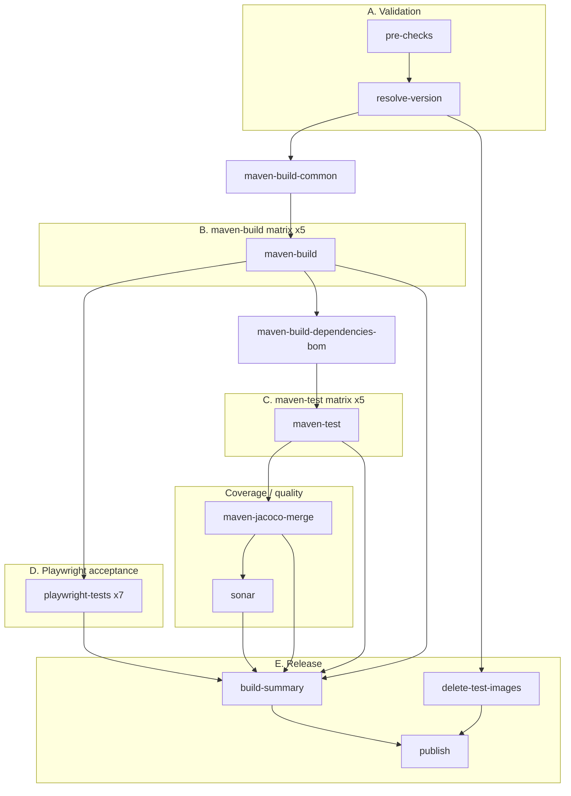

# Parallel CI Pipeline (atomic layout)

This document describes the job layout in [`.github/workflows/main.yml`](../../.github/workflows/main.yml) on branch `ci/parallel-pipeline-poc`.

## Goals

| Goal                      | How                                                                       |
| ------------------------- | ------------------------------------------------------------------------- |
| Short feedback loop       | Validation, builds, unit tests, and Playwright overlap where safe         |
| Rerun-friendly            | One failed shard → rerun one job (build, test, Playwright shard)          |
| No duplicate builds/tests | Build once per shard; M2 artifacts shared; tests never recompile upstream |
| Full coverage             | All unit shards + Playwright on 7 broker profiles                         |
| Maintainability           | Reusable shard workflows + explicit `needs` per dependency                |

## Architecture



### Why split build and test?

Cross-shard Maven modules depend on `activiti-cloud-dependencies` / `activiti-cloud-dependencies-parent`, which import **all** service BOMs. Those BOMs are only installed in `maven-build-dependencies-bom` after every shard build completes.

If build and test live in one reusable workflow (`build` → `test` per cell), tests start as soon as **their** build finishes — before other shards and before the aggregated BOM. That breaks shards like `messages-graphql` and `connectors-examples`.

Correct order: **all builds → BOM → all tests**.

GitHub Actions limitation: separate `maven-build` and `maven-test` matrix jobs cannot express per-shard pairing (`test(core)` needs only `build(core)`). A test matrix with `needs: maven-build` waits for **all** build cells. That is acceptable here because tests need the BOM anyway.

`main.yml` calls reusable workflows for Maven build (docker images + libraries), test, and Playwright. **Docker build matrix** comes from `scan-image-dirs` + [`.github/ci/docker-image-services.json`](../../.github/ci/docker-image-services.json); **library builds** use [`.github/ci/library-modules.json`](../../.github/ci/library-modules.json). **Test shards** and Playwright profiles are in [`.github/ci/maven-shards.json`](../../.github/ci/maven-shards.json) and [`.github/ci/playwright-profiles.json`](../../.github/ci/playwright-profiles.json). See also [process-services alignment](process-services-alignment.md).

Matrix id lists in YAML must match JSON keys — enforced by [`scripts/ci/validate-ci-matrix-lists.sh`](../../scripts/ci/validate-ci-matrix-lists.sh) (pre-commit hook `validate-ci-matrix-lists`).

## Job reference

| Job                            | Runs exactly once per workflow? | Purpose                                                                                         |
| ------------------------------ | ------------------------------- | ----------------------------------------------------------------------------------------------- |
| `pre-checks`                   | ✓                               | Lint/pre-commit, dependabot gate, SHA pins                                                      |
| `resolve-version`              | ✓                               | PR snapshot / release version                                                                   |
| `maven-build-common`           | ✓                               | Shared foundations + common tests (`api`, `service-common`)                                     |
| `scan-image-dirs`              | ✓                               | Discover Docker image dirs; build matrix JSON                                                   |
| `maven-build`                  | 4 matrix cells                  | Per docker image: `mvn install -pl … -am` + Docker push (no m2-common download)                 |
| `maven-build-libraries`        | 2 matrix cells                  | Library-only modules (messages-graphql, audit)                                                  |
| `maven-build-dependencies-bom` | ✓                               | Aggregated BOM after all service/library builds                                                 |
| `maven-test`                   | 5 matrix cells                  | `mvn verify` per shard (after BOM)                                                              |
| `maven-jacoco-merge`           | ✓                               | Merge JaCoCo from 5 test shards                                                                 |
| `sonar`                        | ✓                               | SonarCloud: restore M2, compile, `jacoco:report` from merged exec (same as `develop`), analysis |
| `playwright-tests`             | 7 matrix cells                  | Helm + full Playwright suite per broker profile                                                 |
| `build-summary`                | ✓                               | Merge gate (build, tests, coverage, Playwright)                                                 |
| `delete-test-images`           | ✓                               | Delete stale PR Docker tags before fresh push (parallel with builds)                            |
| `publish`                      | ✓ (push / preview PR)           | Maven deploy after `build-summary` green                                                        |

Legacy monolithic `acceptance-tests` job is **removed** — Playwright runs on the same broker profiles instead.

### Playwright matrix profiles

| Profile                            | Broker   | Partitioning    | Destinations          |
| ---------------------------------- | -------- | --------------- | --------------------- |
| `rabbitmq-partitioned-default`     | rabbitmq | partitioned     | default-destinations  |
| `rabbitmq-non-partitioned-default` | rabbitmq | non-partitioned | default-destinations  |
| `kafka-partitioned-default`        | kafka    | partitioned     | default-destinations  |
| `kafka-non-partitioned-default`    | kafka    | non-partitioned | default-destinations  |
| `kafka-partitioned-override`       | kafka    | partitioned     | override-destinations |
| `rabbitmq-non-partitioned-pdb`     | rabbitmq | non-partitioned | pdb                   |
| `rabbitmq-prefix-pdb`              | rabbitmq | prefix          | pdb                   |

Each cell: install Helm → health checks → `prepare-preview-for-playwright` → `npm run test:all` (full suite) → teardown. `max-parallel: 4` matches shared cluster capacity.

### Maven shards

| Shard                 | Build `-pl … -am`                        | Docker                       | Test scope                                  |
| --------------------- | ---------------------------------------- | ---------------------------- | ------------------------------------------- |
| `core`                | `activiti-cloud-api` (reinstall for M2)  | —                            | `build`, `api`, `service-common` unit tests |
| `runtime-bundle`      | RB service + example starter             | `example-runtime-bundle`     | RB reactor roots                            |
| `query-audit`         | query, audit, query examples             | `activiti-cloud-query`       | query/audit reactors                        |
| `messages-graphql`    | messages + notifications-graphql         | —                            | respective reactors                         |
| `connectors-examples` | connectors + examples + identity-adapter | connector + identity-adapter | respective reactors                         |

`query-audit` examples reactor runs with `-T 1` and `unitTests.parallel=false` (see `mavenTestRootOptions` in `maven-shards.json`) to avoid flaky Testcontainers/Liquibase races.

## Playwright integration

| Job                | Purpose                                                                                                                        |
| ------------------ | ------------------------------------------------------------------------------------------------------------------------------ |
| `playwright-tests` | Matrix ×7. Per cell: Helm install, health checks, overlay, full Playwright suite (`npm run test:all`), Helm delete on failure. |

Playwright starts after `maven-build` (Docker images pushed) and runs **in parallel** with unit tests (`maven-test`).

## Artifacts vs cache vs local build

| Mechanism                               | What                                                | Why                                                                      |
| --------------------------------------- | --------------------------------------------------- | ------------------------------------------------------------------------ |
| **Cache** `~/.m2` (hash of `pom.xml`)   | Third-party + warm Activiti deps                    | Cheap restore; not relied on for cross-job correctness                   |
| **Artifact** `m2-common`                | `org/activiti/cloud/**/<version>` from common build | Required by every shard build/test job                                   |
| **Artifact** `m2-<shard>`               | Shard-specific installed modules                    | Lets test job run `verify` without recompiling                           |
| **Artifact** `m2-dependencies-bom`      | Aggregated dependencies BOM                         | Required by test shards that import cross-shard BOMs                     |
| **Artifact** `jacoco-<shard>`           | `jacoco*.exec` per test shard                       | Inputs to merge (small; cheaper than re-running tests)                   |
| **Artifact** `surefire-reports-<shard>` | On failure only                                     | Debug; 7-day retention                                                   |
| **Artifact** `playwright-diagnostics-*` | Playwright test-results/reporter (on failure only)  | Per-profile debug bundle                                                 |
| **Local in job**                        | `mvn install` / `verify`                            | Source compile must happen on runner (JARs for Docker in same build job) |
| **Not artifacted**                      | Full `target/` trees                                | Upload/download larger than selective rebuild                            |

`publish` restores all `m2-*` artifacts then `mvn deploy -DskipTests` — deploy still resolves from local M2; no second full compile when artifacts are complete.

## `needs` rationale

| Dependent                      | Needs                                                 | Reason                                                                                          |
| ------------------------------ | ----------------------------------------------------- | ----------------------------------------------------------------------------------------------- |
| `maven-build`                  | `pre-checks`, `resolve-version`, `maven-build-common` | Version + shared deps before shard compile                                                      |
| `maven-build-dependencies-bom` | all `maven-build` cells                               | BOM imports every service BOM                                                                   |
| `maven-test`                   | all builds + BOM                                      | Tests need full M2 including aggregated dependencies                                            |
| `playwright-tests`             | `maven-build`                                         | Each profile needs its own Helm install + pushed Docker images                                  |
| `maven-jacoco-merge`           | all builds + BOM + all tests                          | All exec files required for merged coverage                                                     |
| `sonar`                        | `maven-jacoco-merge` + M2 from prior jobs             | Needs `target/classes` (via `compile`), merged JaCoCo exec, then `jacoco:report` like `develop` |
| `build-summary`                | builds, tests, jacoco, sonar, playwright              | PR merge gate                                                                                   |
| `delete-test-images`           | `resolve-version` only                                | Early cleanup of **previous** PR snapshot tags on Docker Hub                                    |
| `publish`                      | builds, BOM, `build-summary`, `delete-test-images`    | Release only after full gate (or `skip-tests` push bypass)                                      |

## Rerun scenarios

| Failure                                      | Rerun                                         |
| -------------------------------------------- | --------------------------------------------- |
| pre-commit / lint                            | `pre-checks` only                             |
| compile in query service                     | `maven-build (query-audit)`                   |
| unit test in RB                              | `maven-test (runtime-bundle)`                 |
| Docker push connector                        | `maven-build (connectors-examples)`           |
| Playwright profile kafka-partitioned-default | `playwright (kafka-partitioned-default)` only |
| JaCoCo merge                                 | `maven-jacoco-merge`                          |
| Sonar                                        | `sonar`                                       |

## Expected impact (vs monolithic `develop` job)

| Metric           | Before (develop)                                       | After (this branch)                                                  |
| ---------------- | ------------------------------------------------------ | -------------------------------------------------------------------- |
| Critical path    | ~30 min sequential `mvn install` + Docker + acceptance | `common` → `max(build shard)` → BOM → `max(test shard)` ∥ Playwright |
| Unit test start  | After entire build                                     | After all builds + BOM                                               |
| Acceptance start | After full build + all tests                           | After shard builds — Playwright ×7 profiles (max 4 parallel)         |
| Rerun cost       | Full `build` job (~30 min)                             | Targeted shard (~5–12 min)                                           |
| Runner cost      | 1 heavy runner for Maven + 7 Helm installs             | More Maven runners; 7 self-contained Playwright matrix cells         |

## Local checks

```bash
scripts/ci/validate-ci-matrix-lists.sh
pre-commit run --files .github/workflows/main.yml .github/workflows/_reusable-*.yml docs/ci/parallel-pipeline-poc.md
```

## Related files

- Workflow: [`.github/workflows/main.yml`](../../.github/workflows/main.yml)
- Reusable: [`_reusable-maven-build.yml`](../../.github/workflows/_reusable-maven-build.yml), [`_reusable-maven-library-build.yml`](../../.github/workflows/_reusable-maven-library-build.yml), [`_reusable-maven-test.yml`](../../.github/workflows/_reusable-maven-test.yml), [`_reusable-playwright-tests.yml`](../../.github/workflows/_reusable-playwright-tests.yml)
- Config: [`.github/ci/docker-image-services.json`](../../.github/ci/docker-image-services.json), [`.github/ci/library-modules.json`](../../.github/ci/library-modules.json), [`.github/ci/maven-shards.json`](../../.github/ci/maven-shards.json), [`.github/ci/playwright-profiles.json`](../../.github/ci/playwright-profiles.json)
- process-services alignment (planned): [`.github/ci/docker-image-services.json`](../../.github/ci/docker-image-services.json), [`docs/ci/process-services-alignment.md`](process-services-alignment.md)
- M2 actions: [`maven-m2-upload`](../../.github/actions/maven-m2-upload), [`maven-m2-download`](../../.github/actions/maven-m2-download)
- CI scripts: [`maven-test-shard.sh`](../../scripts/ci/maven-test-shard.sh), [`validate-ci-matrix-lists.sh`](../../scripts/ci/validate-ci-matrix-lists.sh), [`transform-docker-image-matrix.sh`](../../scripts/ci/transform-docker-image-matrix.sh)
- Playwright env: [`load-acceptance-test-env`](../../.github/actions/load-acceptance-test-env)
