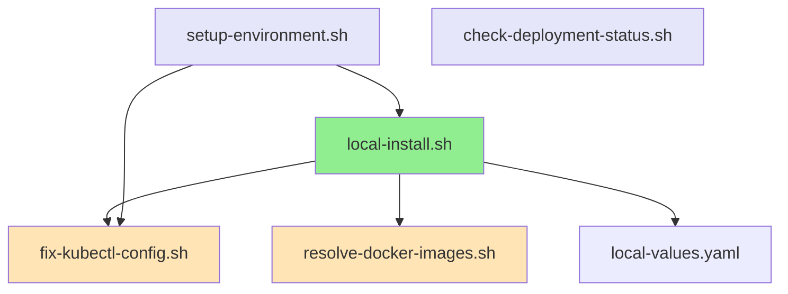

# Activiti Cloud Scripts

This directory contains scripts for complete Activiti Cloud local development setup with automated configuration and testing.

## 🚀 Main Script: `local-install.sh`

**Complete automated local development setup that handles everything from cluster configuration to Playwright testing.**

**Usage:**

```bash
KEYCLOAK_CLIENT_SECRET=<grab-from-keycloak> ./scripts/local-install.sh [options]
```

**Required Prerequisites:**

- kubectl (with Rancher CLI integration)
- helm (version 3+)
- yq (YAML processor)
- python3
- sudo access (for /etc/hosts configuration)

**Options:**

- `-p, --pr <number>` - PR number or identifier (e.g., 123, local-dev)
- `-c, --cluster <name>` - Kubernetes cluster name (default: activiti-hackathon)
- `-b, --broker <broker>` - Messaging broker: `rabbitmq`|`kafka` (default: rabbitmq)
- `-pt, --partitioned <bool>` - Partitioned: `true`|`false` (default: false)
- `-d, --destinations <type>` - Destinations: `default`|`override` (default: default)
- `--dry-run` - Show what would be executed without running
- `-h, --help` - Show help message

**Examples:**

```bash
# Complete setup for PR 123 (recommended)
./scripts/local-install.sh -p 123

# Setup with different cluster
./scripts/local-install.sh -p 123 -c my-cluster

# Advanced configuration with Kafka
./scripts/local-install.sh -p 123 -b kafka -pt true -d override

# Dry run to see what would happen
./scripts/local-install.sh --dry-run -p 123
```

## What the Script Does

### Complete Automated Setup

The `local-install.sh` script provides a fully automated local development environment:

1. **Cluster Configuration**
   - Validates kubectl connection and cluster access
   - Configures kubectl context using Rancher CLI integration
   - Verifies cluster connectivity and namespace permissions

2. **Environment Preparation**
   - Generates PREVIEW_NAME in format: `pr-{number}-{broker}-{partition}-{destination}`
   - Creates local-values.yaml with working Docker image tags (8.8.0-alpha.108)
   - Sets up environment variables for consistent deployment

3. **Kubernetes Deployment**
   - Creates and configures namespace with proper labels
   - Deploys Activiti Cloud using Helm with local-values.yaml by default
   - Patches deployments with correct external Keycloak configuration

4. **Local Access Configuration**
   - Automatically configures /etc/hosts entries for gateway routing
   - Sets up port forwarding: localhost:8080 → ingress-nginx-controller
   - Generates .env file for Playwright tests with proper SSO configuration

5. **Keycloak Authentication Setup**
   - Configures external Keycloak URL: `https://{cluster}.envalfresco.com/auth`
   - Sets correct realm: `alfresco`
   - Patches all services with ACT_KEYCLOAK_URL and ACT_KEYCLOAK_REALM
   - Validates JWT configuration across all deployments

6. **Health Validation**
   - Verifies all pods are running and ready
   - Tests service endpoints and authentication
   - Confirms Playwright test configuration

## 📋 All Available Scripts

### 🟢 **Essential Scripts**

#### 1. `local-install.sh` - ⭐ **PRIMARY SCRIPT**

**Complete automated local development setup**

- **Purpose**: One-command solution for complete Activiti Cloud local environment
- **Status**: **ESSENTIAL - Main script for all local development**  
- **Dependencies**: `fix-kubectl-config.sh`, `resolve-docker-images.sh`
- **Features**:
  - Cluster configuration and validation
  - Keycloak authentication setup with client secret validation
  - Kubernetes deployment with local-values.yaml integration
  - Automated /etc/hosts configuration
  - Port forwarding setup (localhost:8080 → ingress-nginx-controller)
  - .env file generation for Playwright tests
  - Complete health validation

**Usage:**

```bash
# Basic setup (recommended)
KEYCLOAK_CLIENT_SECRET=<secret> ./scripts/local-install.sh -n michal-test

# Advanced configuration
./scripts/local-install.sh -n my-env -c activiti-hackathon -b kafka -pt true -d override

# Dry run to see what would happen
./scripts/local-install.sh --dry-run -n test-env
```

#### 2. `fix-kubectl-config.sh` - 🔧 **CLUSTER CONNECTOR**

**Parameterized cluster configuration via Rancher CLI**

- **Purpose**: Connects kubectl to different Kubernetes clusters via Rancher
- **Status**: **ESSENTIAL - Required for cluster access**
- **Called by**: `local-install.sh` (automatically when needed)
- **Features**:
  - Auto-detects cluster from rancher context
  - Generates proper kubectl config (not wrapper)
  - Validates cluster connectivity and permissions
  - Supports multiple clusters (not hardcoded)

**Usage:**

```bash
# Connect to default cluster (activiti)
./scripts/fix-kubectl-config.sh

# Connect to specific cluster
./scripts/fix-kubectl-config.sh activiti-hackathon
./scripts/fix-kubectl-config.sh activiti-community
```

#### 3. `resolve-docker-images.sh` - 🐳 **IMAGE RESOLVER**

**Creates local-values.yaml with working Docker image tags**

- **Purpose**: Finds and configures working Docker image versions
- **Status**: **ESSENTIAL - Prevents deployment failures**
- **Called by**: `local-install.sh` (automatically)
- **Features**:
  - Discovers available Docker image tags via API
  - Creates local-values.yaml with tested versions (8.8.0-alpha.108)
  - Prevents broken deployments from missing images
  - Fallback to known working tags

**Usage:**

```bash
# Generate local-values.yaml (called automatically)
./scripts/resolve-docker-images.sh

# Manual execution for custom version
./scripts/resolve-docker-images.sh "8.8.0-alpha.109"
```

### 🟡 **Advanced & Utility Scripts**

#### 4. `setup-environment.sh` - 🚀 **ADVANCED SETUP**

**Comprehensive environment setup with multiple modes**

- **Purpose**: Advanced environment management with granular control
- **Status**: **USEFUL - For complex scenarios**
- **Alternative to**: `local-install.sh` (when you need specific modes)
- **Features**:
  - Multiple modes: `full`, `env-only`, `test-only`, `playwright`
  - Environment variable generation and export
  - Granular control over installation phases
  - Health checks and port forwarding management
  - /etc/hosts configuration
  - Playwright-specific setup

**Usage:**

```bash
# Complete setup (similar to local-install.sh)
./scripts/setup-environment.sh -n test-123 -c activiti-hackathon --mode full

# Only generate environment variables
./scripts/setup-environment.sh -n local-dev -c activiti-community --mode env-only

# Setup for Playwright testing specifically
./scripts/setup-environment.sh -n playwright-test -c activiti-hackathon --mode playwright

# Test existing deployment
./scripts/setup-environment.sh -n test-123 -c activiti-hackathon --mode test-only
```

#### 5. `check-deployment-status.sh` - 🏥 **STATUS CHECKER**

**Pod and service status monitoring**

- **Purpose**: Troubleshooting and monitoring deployed environments
- **Status**: **UTILITY - Helpful for debugging**
- **Use case**: After deployment to check health and debug issues
- **Features**:
  - Pod status with color-coded output
  - Service endpoint testing
  - Image version reporting
  - Useful kubectl commands for debugging
  - Automatic cluster detection

**Usage:**

```bash
# Check status of PR 123 deployment
./scripts/check-deployment-status.sh -p 123

# Check specific preview environment
./scripts/check-deployment-status.sh -p michal-test
```

**Output includes:**

- ✅ Running pods with ready status
- 🌐 Service endpoint health checks
- 🐳 Docker image versions in use
- 💡 Useful debugging commands

## 🔗 Script Dependencies

```text
local-install.sh (main)
├── fix-kubectl-config.sh (cluster setup)
├── resolve-docker-images.sh (working images)
└── local-values.yaml (generated)

setup-environment.sh (advanced)
└── local-install.sh (for installation mode)

check-deployment-status.sh (standalone utility)
```

## 📚 Documentation Files

- **`README.md`** - This file, complete script documentation
- **`INSTALL_GUIDE.md`** - Step-by-step installation guide with troubleshooting

## 🗑️ Recently Removed Scripts

The following scripts were removed as they are no longer needed:

- ❌ `fix-makefile.sh` - Deprecated (local-install.sh handles everything directly)
- ❌ `kubectl-wrapper.sh` - Replaced by fix-kubectl-config.sh  
- ❌ `set-preview-env.sh` - Broken (referenced missing scripts)
- ❌ `setup-rancher.sh` - Too complex (fix-kubectl-config.sh is simpler)

## Key Features

### ✅ DNS Resolution via localhost

- Port forwarding from localhost:8080 to ingress-nginx-controller
- Automated /etc/hosts configuration for gateway domains
- No need for complex DNS setup or VPN connections

### ✅ Working Docker Images

- Integrates local-values.yaml with tested image tags by default
- Uses 8.8.0-alpha.108 versions that are known to work
- Prevents deployment failures from missing or broken images

### ✅ Complete Keycloak Integration

- External Keycloak URL configuration for all services
- Proper realm and client configuration
- JWT validation fixes for multi-namespace deployments
- Automated secret configuration

### ✅ Playwright Test Ready

- Generates proper .env configuration automatically
- HTTP protocol for localhost:8080 access
- Correct SSO_HOST and authentication setup
- Ready to run tests immediately after deployment

### ✅ Multi-Cluster Support

- Parameterized cluster names (not hardcoded to activiti-hackathon)
- Works with any Rancher-managed Kubernetes cluster
- Automatic kubectl context switching

## Generated Environment

The script creates this complete local development setup:

- **Namespace**: `pr-{number}-rabbit-n-d` (e.g., `pr-123-rabbit-n-d`)
- **Local Access**: `http://localhost:8080` → gateway services
- **SSO Integration**: External Keycloak at `https://{cluster}.envalfresco.com/auth`
- **DNS Resolution**: Automated /etc/hosts entries for `{namespace}.{cluster}.envalfresco.com`
- **Test Configuration**: Ready-to-use .env file for Playwright tests

## 📋 All Available Scripts

### 🟢 **Essential Scripts**

#### 1. **`local-install.sh`** - ⭐ **PRIMARY SCRIPT**
**Complete automated local development setup**

- **Purpose**: One-command solution for complete Activiti Cloud local environment
- **Status**: **ESSENTIAL - Main script for all local development**
- **Dependencies**: `fix-kubectl-config.sh`, `resolve-docker-images.sh`
- **Features**:
  - Cluster configuration and validation
  - Keycloak authentication setup with client secret validation
  - Kubernetes deployment with local-values.yaml integration
  - Automated /etc/hosts configuration
  - Port forwarding setup (localhost:8080 → ingress-nginx-controller)
  - .env file generation for Playwright tests
  - Complete health validation

**Usage:**
```bash
# Basic setup (recommended)
KEYCLOAK_CLIENT_SECRET=<secret> ./scripts/local-install.sh -n michal-test

# Advanced configuration
./scripts/local-install.sh -n my-env -c activiti-hackathon -b kafka -pt true -d override

# Dry run to see what would happen
./scripts/local-install.sh --dry-run -n test-env
```

#### 2. **`fix-kubectl-config.sh`** - 🔧 **CLUSTER CONNECTOR**
**Parameterized cluster configuration via Rancher CLI**

- **Purpose**: Connects kubectl to different Kubernetes clusters via Rancher
- **Status**: **ESSENTIAL - Required for cluster access**
- **Called by**: `local-install.sh` (automatically when needed)
- **Features**:
  - Auto-detects cluster from rancher context
  - Generates proper kubectl config (not wrapper)
  - Validates cluster connectivity and permissions
  - Supports multiple clusters (not hardcoded)

**Usage:**
```bash
# Connect to default cluster (activiti)
./scripts/fix-kubectl-config.sh

# Connect to specific cluster
./scripts/fix-kubectl-config.sh activiti-hackathon
./scripts/fix-kubectl-config.sh activiti-community
```

#### 3. **`resolve-docker-images.sh`** - 🐳 **IMAGE RESOLVER**
**Creates local-values.yaml with working Docker image tags**

- **Purpose**: Finds and configures working Docker image versions
- **Status**: **ESSENTIAL - Prevents deployment failures**
- **Called by**: `local-install.sh` (automatically)
- **Features**:
  - Discovers available Docker image tags via API
  - Creates local-values.yaml with tested versions (8.8.0-alpha.108)
  - Prevents broken deployments from missing images
  - Fallback to known working tags

**Usage:**
```bash
# Generate local-values.yaml (called automatically)
./scripts/resolve-docker-images.sh

# Manual execution for custom version
./scripts/resolve-docker-images.sh "8.8.0-alpha.109"
```

### 🟡 **Advanced & Utility Scripts**

#### 4. **`setup-environment.sh`** - 🚀 **ADVANCED SETUP**
**Comprehensive environment setup with multiple modes**

- **Purpose**: Advanced environment management with granular control
- **Status**: **USEFUL - For complex scenarios**
- **Alternative to**: `local-install.sh` (when you need specific modes)
- **Features**:
  - Multiple modes: `full`, `env-only`, `test-only`, `playwright`
  - Environment variable generation and export
  - Granular control over installation phases
  - Health checks and port forwarding management
  - /etc/hosts configuration
  - Playwright-specific setup

**Usage:**
```bash
# Complete setup (similar to local-install.sh)
./scripts/setup-environment.sh -n test-123 -c activiti-hackathon --mode full

# Only generate environment variables
./scripts/setup-environment.sh -n local-dev -c activiti-community --mode env-only

# Setup for Playwright testing specifically
./scripts/setup-environment.sh -n playwright-test -c activiti-hackathon --mode playwright

# Test existing deployment
./scripts/setup-environment.sh -n test-123 -c activiti-hackathon --mode test-only
```

#### 5. **`check-deployment-status.sh`** - 🏥 **STATUS CHECKER**
**Pod and service status monitoring**

- **Purpose**: Troubleshooting and monitoring deployed environments
- **Status**: **UTILITY - Helpful for debugging**
- **Use case**: After deployment to check health and debug issues
- **Features**:
  - Pod status with color-coded output
  - Service endpoint testing
  - Image version reporting
  - Useful kubectl commands for debugging
  - Automatic cluster detection

**Usage:**
```bash
# Check status of PR 123 deployment
./scripts/check-deployment-status.sh -p 123

# Check specific preview environment
./scripts/check-deployment-status.sh -p michal-test
```

**Output includes:**
- ✅ Running pods with ready status
- 🌐 Service endpoint health checks
- 🐳 Docker image versions in use
- 💡 Useful debugging commands

## 🔗 Script Dependencies



## 📚 Documentation Files

- **`README.md`** - This file, complete script documentation
- **`INSTALL_GUIDE.md`** - Step-by-step installation guide with troubleshooting

## 🗑️ Recently Removed Scripts

The following scripts were removed as they are no longer needed:

- ❌ `fix-makefile.sh` - Deprecated (local-install.sh handles everything directly)
- ❌ `kubectl-wrapper.sh` - Replaced by fix-kubectl-config.sh  
- ❌ `set-preview-env.sh` - Broken (referenced missing scripts)
- ❌ `setup-rancher.sh` - Too complex (fix-kubectl-config.sh is simpler)

## PREVIEW_NAME Format

The deployment namespace follows this consistent pattern:

```text
pr-{number}-{broker}-{partition}-{destination}
```

Where:

- **number**: PR number or identifier (e.g., 123, local-dev)
- **broker**: First 6 characters of broker name (`rabbit` or `kafka`)  
- **partition**: `n` for non-partitioned, `p` for partitioned
- **destination**: `d` for default, `o` for override

**Examples:**

- `pr-123-rabbit-n-d` - PR 123, RabbitMQ, non-partitioned, default destinations
- `pr-456-kafka-p-o` - PR 456, Kafka, partitioned, override destinations

## Usage Scenarios

### Quick Local Development

```bash
# One command setup - everything automated
./scripts/local-install.sh -n 123

# Access your deployment immediately
open http://localhost:8080

# Run Playwright tests
cd activiti-cloud-acceptance-tests-playwright
npm test
```

### Different Cluster

```bash
# Use different cluster than default activiti
./scripts/local-install.sh -n 123 -c my-cluster-name
```

### Advanced Configuration

```bash
# Kafka with partitioning and override destinations
./scripts/local-install.sh -n 123 -b kafka -pt true -d override
```

### Testing and Validation

```bash
# See what would happen without executing
./scripts/local-install.sh --dry-run -n 123

# Check deployment after installation
kubectl get pods -n pr-123-rabbit-n-d
kubectl get services -n pr-123-rabbit-n-d
```

## Integration with Testing

### Playwright Tests

The script automatically generates a `.env` file for Playwright testing:

```bash
# After running local-install.sh
cd activiti-cloud-acceptance-tests-playwright
npm test  # Uses generated .env configuration
```

### Manual Testing

Access services directly via localhost:

```bash
# Gateway endpoint
curl http://localhost:8080/rb/actuator/health

# With authentication
curl -H "Host: pr-123-rabbit-n-d.activiti.envalfresco.com" 
     http://localhost:8080/rb/actuator/health
```

## Troubleshooting

### Common Solutions

1. **kubectl connection issues**

   ```bash
   ./scripts/fix-kubectl-config.sh
   kubectl cluster-info
   ```

2. **Port forwarding problems**

   ```bash
   # Kill existing port forwards
   pkill -f "kubectl.*port-forward"
   # Script will recreate automatically
   ```

3. **DNS resolution issues**

   ```bash
   # Check /etc/hosts entries
   grep "envalfresco.com" /etc/hosts
   # Script manages these automatically
   ```

4. **Authentication failures**

   ```bash
   # Check Keycloak configuration
   kubectl get configmap -n pr-123-rabbit-n-d
   kubectl describe deployment -n pr-123-rabbit-n-d
   ```

This represents the current working state of our local development workflow, with all authentication issues resolved and complete automation for reliable deployments.

## Usage Scenarios

### Quick Local Development

```bash
# One command setup - everything automated
./scripts/local-install.sh -p 123

# Access your deployment immediately
open http://localhost:8080

# Run Playwright tests
cd activiti-cloud-acceptance-tests-playwright
npm test
```

### Different Cluster

```bash
# Use different cluster than default activiti
./scripts/local-install.sh -p 123 -c my-cluster-name
```

### Advanced Configuration

```bash
# Kafka with partitioning and override destinations
./scripts/local-install.sh -p 123 -b kafka -pt true -d override
```

### Testing and Validation

```bash
# See what would happen without executing
./scripts/local-install.sh --dry-run -p 123

# Check deployment after installation
kubectl get pods -n pr-123-rabbit-n-d
kubectl get services -n pr-123-rabbit-n-d
```

This represents the current working state of our local development workflow, with all authentication issues resolved and complete automation for reliable deployments.
